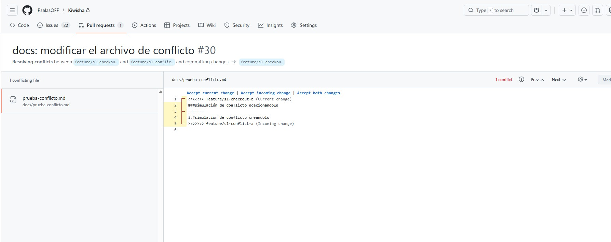
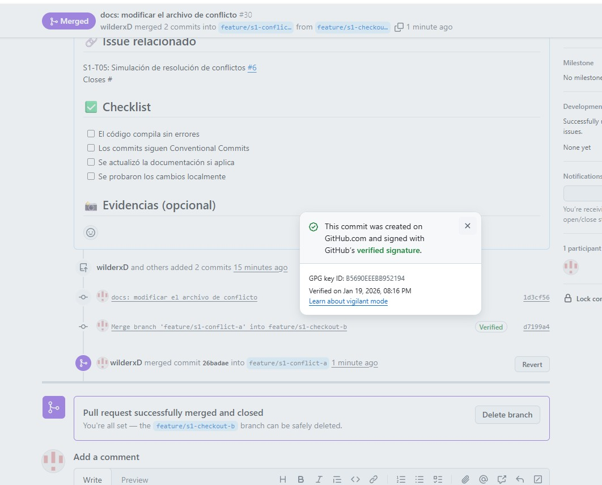

# Evidencias del Sprint 1 - Proyecto Kiwisha

**Proyecto:** Kiwisha E-Commerce
**Sprint:** 1 (Semanas 1-2)
**Versión Entregada:** v0.1.0

## 1. Enlaces Maestros de Gestión (Project Management)
Aquí se centralizan las herramientas de planificación y seguimiento utilizadas por el Product Owner y el Scrum Master.

| Herramienta | Descripción | Enlace / Evidencia |
| :--- | :--- | :--- |
| **GitHub Project Board** | Tablero Kanban (Backlog, In Progress, Done) | [Ver Tablero del Proyecto](https://github.com/RsalasOFF/Kiwisha) |
| **Milestone** | Sprint 1 (Objetivos y fechas) | [Ver Milestone Sprint 1](https://github.com/RsalasOFF/Kiwisha/milestone/1) |
| **Backlog Priorizado** | Lista de User Stories del Sprint 1 | [Ver Issues del Sprint 1](https://github.com/RsalasOFF/Kiwisha/issues) |

## 2. Evidencias de Calidad y Gobierno (Scrum Master)
Configuraciones de seguridad y normas de contribución.

| Criterio | Descripción | Evidencia |
| :--- | :--- | :--- |
| **Branch Protection** | Reglas para `main`: Require PR, Require approvals. |  |
| **Release Final** | Tag v0.1.0 y notas de lanzamiento. | [Ver Release v0.1.0](https://github.com/RsalasOFF/Kiwisha/tree/v0.1.0) |

## 3. Tabla de Trazabilidad por Rol

A continuación se detallan las evidencias de cumplimiento de los objetivos del Sprint 1 para cada integrante del equipo.

| Rol | Integrante | Tarea / Issue | Pull Request (PR) | Evidencia Clave |
| :--- | :--- | :--- | :--- | :--- |
| **PO** | Ricardo | **Backlog & Issues**   (Crear S1-US01 a S1-US12 + Tablero) | [PR: docs backlog Sprint 1]([https://github.com/RsalasOFF/Kiwisha/pull/28])   *(Rama: feature/s1-backlog-po)* |
| **SM** | Franco | **Proceso & Protección**   (Branch Protection + CONTRIBUTING) | [PR: docs workflow]([https://github.com/RsalasOFF/Kiwisha/pull/26])   *(Rama: feature/s1-workflow-sm)* | **Protección Main:** `img/S1_E_branch_protection.jpg`   **Reglas:** `CONTRIBUTING.md` |
| **Dev A** | Marcos | **Templates GitHub**   (Issue forms + PR Template) | [PR: feat templates]([https://github.com/RsalasOFF/Kiwisha/pull/1])   *(Rama: feature/s1-templates)* | **Captura:** `img/S1_E_templates_demo.png`   (Issue de prueba creado) |
| **Dev B** | Wilder | **Release & Evidencias**   (Changelog + Release v0.1.0) | [PR: release notes]([https://github.com/RsalasOFF/Kiwisha/tree/v0.1.0])   *(Rama: feature/s1-release-notes)* | **Release:** [v0.1.0](["link"])   **Captura:** `img/S1_E06_release.png` |
| **Dev C** | Jose | **Conflicto Real**   (Generar y resolver conflicto) | [PR: fix conflicto]([https://github.com/RsalasOFF/Kiwisha/pull/30])   *(Rama: feature/s1-conflict-b)* | **SHA Resolución:** `[d7199a4]`   **Capturas:** Ver sección 2 |

---

## 4. Detalle del Conflicto Real (Dev C)

Se evidencia el manejo de conflictos en Git según el punto simulado.

* **Archivo afectado:** `docs/flujo-trabajo.md`
* **Escenario:** Dos ramas intentaron editar la misma línea simultáneamente.

### Pasos Ejecutados:
1.  **Rama A (`feature/s1-conflict-a`):** Modificó el archivo y se fusionó a feature/s1-conflict-b.
2.  **Rama B (`feature/s1-conflict-b`):** Modificó el archivo (desde una versión anterior) con otro texto.
3.  **Resultado:** GitHub bloqueó el Merge automático.

### Evidencias Gráficas:

**A. Bloqueo en GitHub (Antes):**

**B. Resolución y Merge (Después):**

**C. Commit de Resolución (SHA):**
El conflicto fue resuelto manualmente en el commit: `[d7199a4]`

---

## 5. Conclusión del Sprint

El equipo ha configurado exitosamente el entorno de desarrollo, estableciendo las normas de colaboración (Gitflow), plantillas de estandarización y la planificación inicial (Backlog), culminando con el Release **v0.1.0**.
